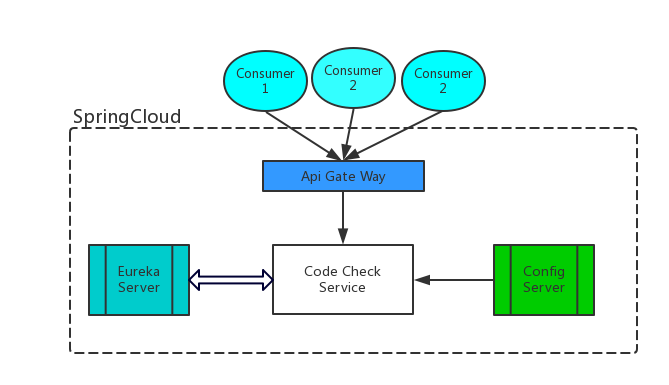
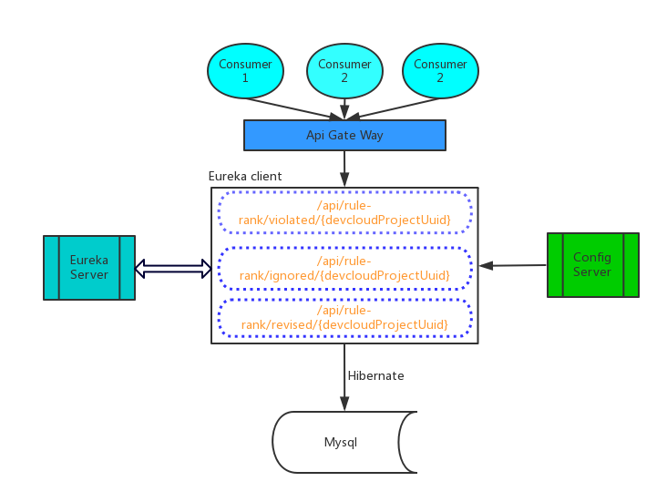

# Code Check Service 后端技术
## Code Check Service业务场景简介
**项目级别被违反最多的规则排名接口**
作为租户/用户，想要查看指定项目下，被违反最多的规则排名，以便更好的定制规则和帮助提升代码质量。

**项目级别扫描时屏蔽最多的规则排名接口**
作为租户/用户，想要查看指定项目下，被屏蔽最多的规则排名，以便更好的定制规则和帮助提升代码质量。
***屏蔽***：忽略扫描出来的问题， 包括批忽略以及单独忽略

**项目级别问题修复最多的规则排名接口**
作为华为企业云的租户/用户，我想要查看指定项目的仓库扫描结果里， 被修复最多的规则排名， 以便于更好的定制规则

## Code Check 采用的技术
Code Check采用spring cloud以微服务地形式提供后台接口。



<br>
Note: <br>
SpringCloud 版本1.4.4.RELEASE <br>
Mysql 5.6

## 接口描述

###项目级别圈复杂度排名接口
```
http://${host}:2223/api/codecheck/projects/${devcloudProjectUuid}/repos/complexity
```
###租户级别圈复杂度排名接口
```
http://${host}:2223/api/codecheck/tenants/${tenantId}/repos/complexity
```
###项目级重复行排名接口
```
http://${host}:2223/api/codecheck/projects/${devcloudProjectUuid}/repos/duplicatedLine
```
###租户级重复行排名接口
```
http://${host}:2223/api/codecheck/tenants/${tenantId}/repos/duplicatedLine
```
###项目级别被违反最多的规则排名接口
```
http://${host}:2223/api/codecheck/projects/${devcloudProjectUuid}/rules/violated
```
###租户级别被违反最多的规则排名接口
```
http://${host}:2223/api/codecheck/tenants/${tenantId}/rules/violated
```
###项目级别扫描时屏蔽最多的规则排名接口
```
http://${host}:2223/api/codecheck/projects/${devcloudProjectUuid}/rules/ignored
```
###租户级别扫描时屏蔽最多的规则排名接口
```
http://${host}:2223/api/codecheck/tenants/${tenantId}/rules/ignored
```
###项目级别问题修复最多的规则排名接口
```
http://${host}:2223/api/codecheck/projects/${devcloudProjectUuid}/rules/revised
```
###租户级别问题修复最多的规则排名接口
```
http://${host}:2223/api/codecheck/tenants/${tenantId}/rules/revised
```
**违法规则排名response**

```javascript
{
    "status": "success",
    "error": "",
    "result": {
        "total": "3", // 满足查询条件的规则数
        "info": [
            {
                "rank": 1,                      // 规则排名
                "ruleName": "AcompareB",        // 规则名字
                "priority": 2,                  // 问题级别
                "category": "0",                // 问题分类
                "language": "JavaScript",       // 语言
                "tag": "",                      // 标签
                "counts": 64                    // 被违法/屏蔽/修复的次数
            },
            {
                "rank": 2,
                "ruleName": "BetterDotNotation",
                "priority": 2,
                "category": "0",
                "language": "JavaScript",
                "tag": "",
                "counts": 24
            },
            {
                "rank": 3,
                "ruleName": "UnexpectedExpression",
                "priority": 2,
                "category": "0",
                "language": "JavaScript",
                "tag": "",
                "counts": 8
            }
        ],
        "repoCheckedCount": "1",             // 检查仓库总数
        "projectCount": "1"                 //检查项目总数（租户下使用）
    }
}
```
**圈复杂度response**

```javascript
{
  "result": {
    "total": "1",
    "info": [
      {
        "projectName": "project name",
        "rank": 1,
        "repoName": "git@codehub.devcloud.hwclouds.com:ssss/nannan.git",
        "fileComplexity": 12.4,
        "functionComplexity": 12.8,
        "complexity": 123
      }
    ],
    "repoCheckedCount": "8",
    "projectCount": "3"
  }
}
```

**代码重复率response**

```javascript
{
  "result": {
    "total": "3",
    "info": [
      {
        "projectName": "project name",
        "rank": 1,
        "repoName": "git@codehub.devcloud.hwclouds.com:ssss/cdcdcdcdcdcd.git",
        "duplicatedLinesDensity": "2.00%",
        "codeLines": 1234,
        "duplicatedLines": 32
      }
    ],
    "repoCheckedCount": "8",
    "projectCount": "3"
  }
}
```
## 启动
### mvn clean spring-boot:run
